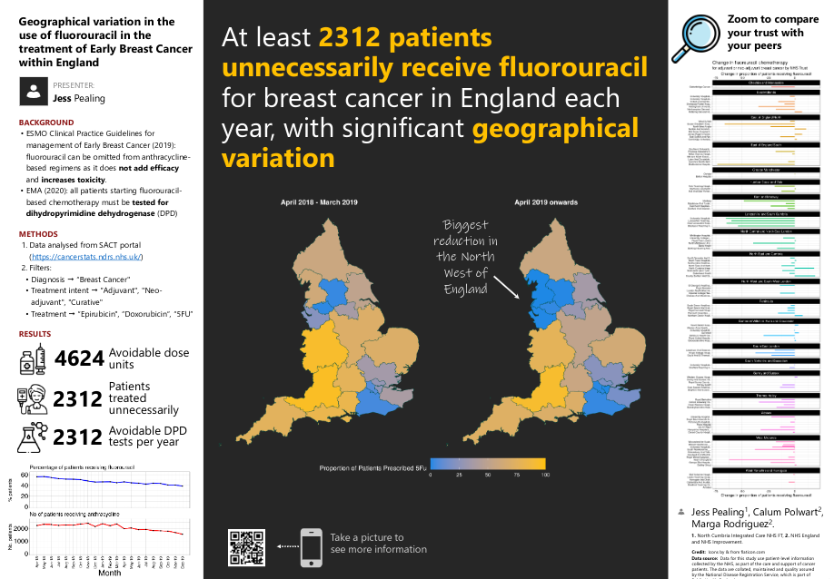

```{r setup, include=FALSE}
knitr::opts_chunk$set(echo = FALSE)
```

This poster was presented by Jess Pealing at the British Oncology Pharmacy Association Annual Symposium. The poster was developed to review the variation in the use of fluorouracil in the management of Early Breast Cancer within England. The ESMO guidelines[@cardoso2019] no longer recommend the routine use of fluoropyramidines, however, we were aware that many centres continued to use fluorouracil and we sought to identify the extent of variation.

{.external}

The abstracts for this meeting are published in the Journal of Oncology Pharmacy Practice[@abstract2021a]. The poster is available on Research Gate[@pealing2020].

A number of people asked following this poster how we developed the map, and we have published a simplified version of the [code on Research Gate](https://www.researchgate.net/publication/344596453_Cancer_Alliance_Map_-_Simplified_Example_Code).
