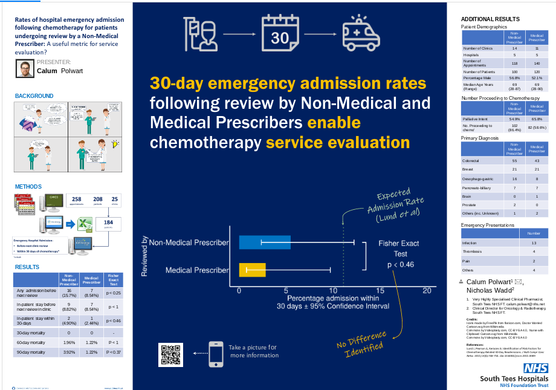

Poster presented at British Oncology Pharmacy Association Annual Symposium 2020[@abstract2021]. This poster looked to identify the rate of hospital admission following non-medical prescriber review of patients undergoing systemic anti-cancer therapy, as a measure for service evaluation of Non-Medical Prescribing Clinics.

[{.external}](https://www.researchgate.net/publication/344558920_Rates_of_hospital_emergency_admission_following_chemotherapy_for_patients_undergoing_review_by_a_Non-Medical_Prescriber_A_useful_metric_for_service_evaluation)
